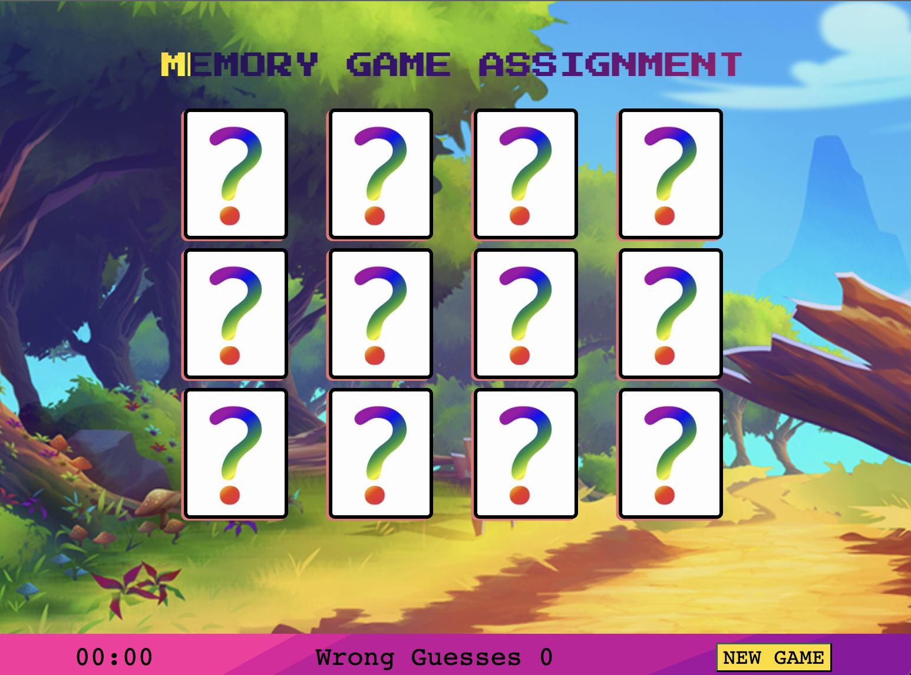

# Memory Game Assignment - Weekend Project
# AppleSeeds Bootcamp

This weekend we worked on a new project called memory game.\
In this project, we used HTML, CSS, and js.\
[Abed](https://github.com/abedkhalaf8) worked on the design of the page HTML & CSS.\
[Itamar](https://github.com/ItamarShmaya) and [Shira](https://github.com/ShiraOhana) worked on the functions of the js file.

[Link to the game project](https://www.memory-game-assignment.netlify.app/)

