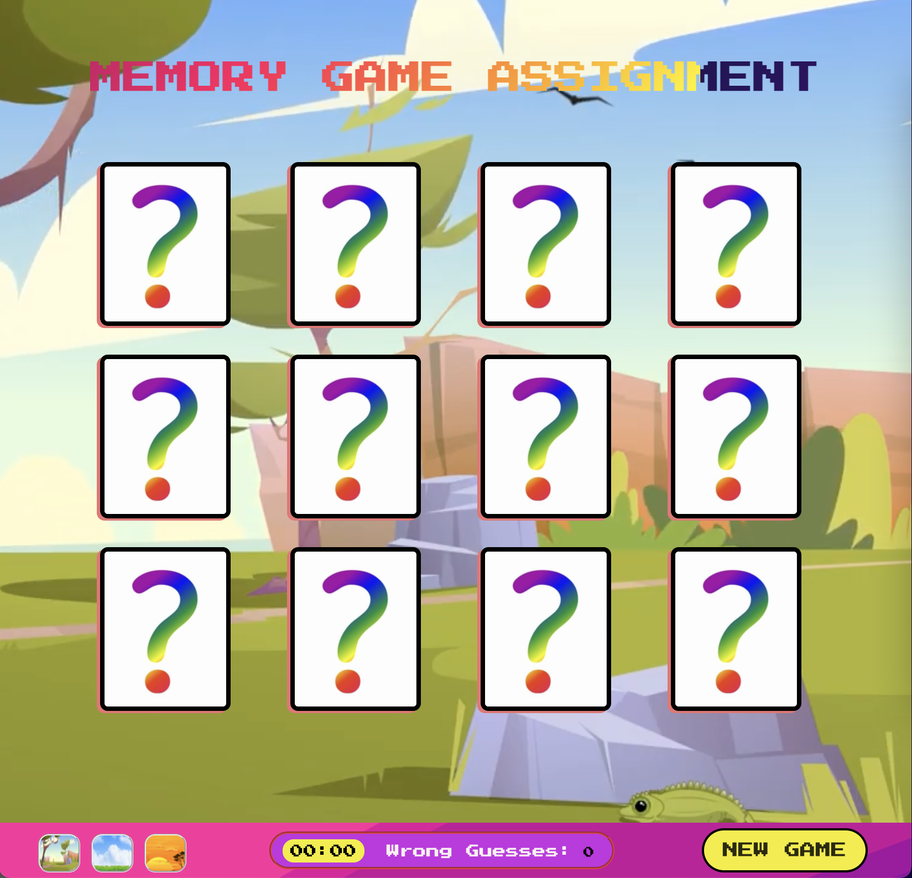

# AppleSeeds Bootcamp 
# Memory Game Assignment 
 
This weekend we worked on a new project called memory game.\
In this project, we used HTML, CSS, and js.\
[Abed](https://github.com/abedkhalaf8) worked on the design of the page HTML & CSS, JS levels feature.\
[Itamar](https://github.com/ItamarShmaya) and [Shira](https://github.com/ShiraOhana) worked on the functions of the js file.

## Main features of the game
* Timer
* Counter of wrong guesses
* Background music and sound for every move
* Three game themes
* Three levels of difficulty the user can choose from
* "New game" button

[Link to our game project](https://memorygproject.netlify.app/)

